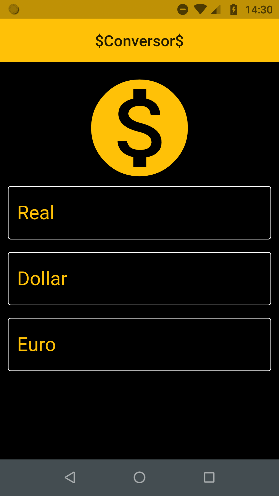
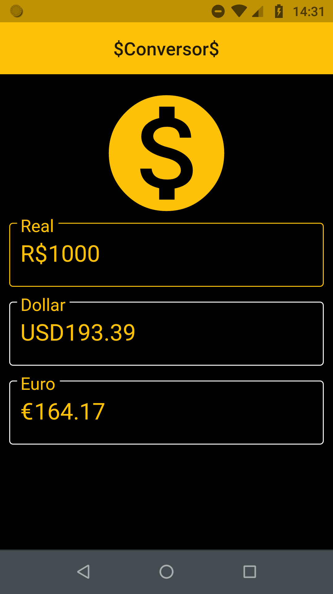

# Currency Converter
Repository for project Currency Converter

# Description
the project receives a value as input in one of the three available fields, with that information it converts the value to the other monetary systems.

# Technologies
The application was full developed using flutter.

# Screenshots

  
  

## Getting Started
This project is a starting point for a Flutter application.

A few resources to get you started if this is your first Flutter project:

- [Lab: Write your first Flutter app](https://flutter.dev/docs/get-started/codelab)
- [Cookbook: Useful Flutter samples](https://flutter.dev/docs/cookbook)

For help getting started with Flutter, view our
[online documentation](https://flutter.dev/docs), which offers tutorials,
samples, guidance on mobile development, and a full API reference.
